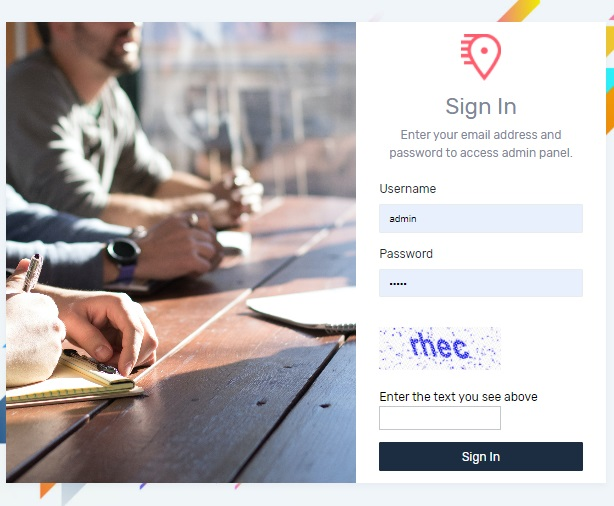
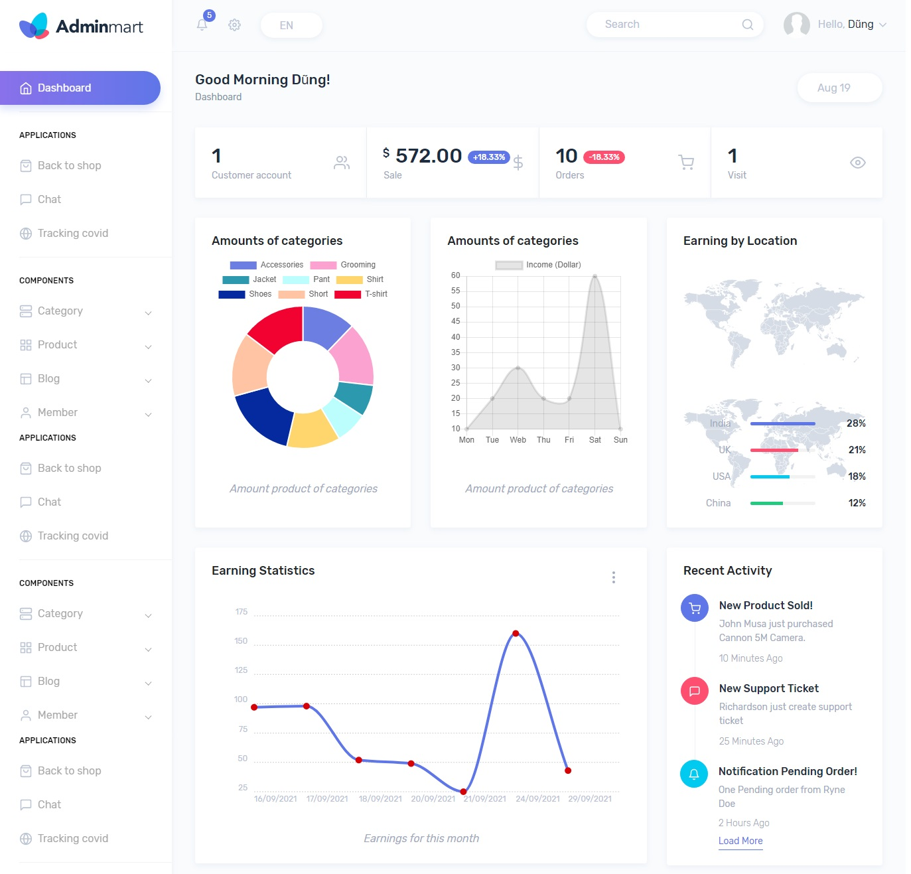

# E-commerce Online shopping men clothes - ASP.NET MVC 5, Entity Framework

* The project create by ASP.NET MVC 5, Entity Frameword, SQL Server
* I have developed this website and database all by myself and I would be happy to share it for the community.
* Hope you like it 👍. Give me a star if you like it ⭐

## Feature
### Customer site
-   Login, register account
-   Edit profile and password
-   Searching product
-   Pagination
-   Filtering and paging with product and category
-   View product detail
-   Shopping cart
-   Online payment using Paypal
-   View orders placed  and check order Detail
-   View list article SEO product and article detail
-   Online support witch Chatbox
### Admin area
-   CRUD operation (AJAX)
-   Send email
-   Update status orders
-   Sales statistics on charts

## Screenshot
- Main site

 

- Login
 
  
 
- Admin
 
  

 

[View on youtube](https://youtu.be/xcqi7A-sCgo)
